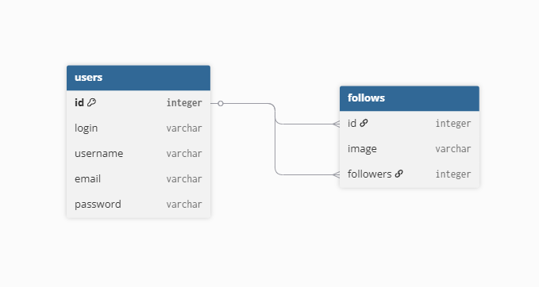

# Сайт с новинками игр
Платформа для отслеживания новых релизов в игровой индустрии.

## Предметная область
Данный проект - это веб-сайт, посвященный новинкам компьютерных и консольных игр. Пользователи могут создавать личные кабинеты, отслеживать новые игры.

### Основные сущности:
- **Игры** - цифровые продукты с метаданными (жанр, платформа, дата выхода)
- **Издатели** - компании-разработчики и дистрибьюторы
- **Пользователи** - зарегистрированные участники с персональными коллекциями

### Ключевые процессы:
- Мониторинг новых релизов
- Составление персональных списков желаемого
- Оценка и рецензирование игр
- Уведомления о предстоящих релизах
- Сравнение игр по различным параметрам

### ER диаграмма бд

## Технологии

- **MAMP**
- **php**
- **MySQL** 
- **HTML/CSS** 
